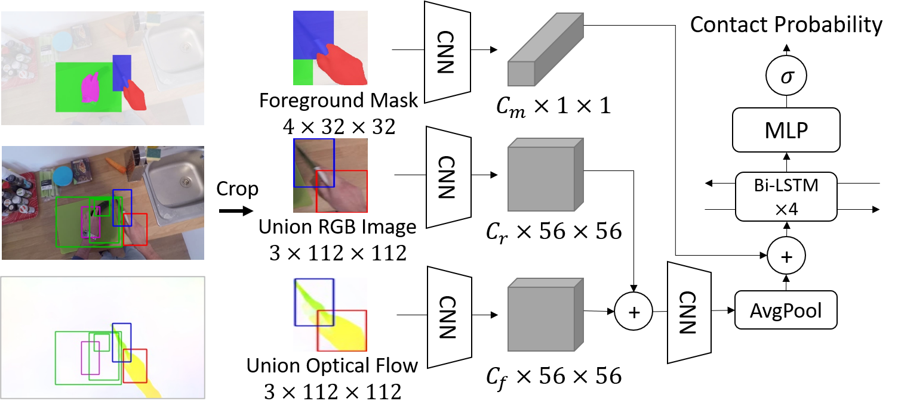

# Hand-Object Contact Prediction (BMVC2021)
This repository contains the code and data for the paper ["Hand-Object Contact Prediction via Motion-Based Pseudo-Labeling and Guided Progressive Label Correction"](https://arxiv.org/abs/2110.10174) by Takuma Yagi, Md. Tasnimul Hasan and Yoichi Sato.



## Requirements
* Python 3.6+
* ffmpeg
* numpy
* opencv-python
* pillow
* scikit-learn
* python-Levenshtein
* pycocotools
* torch (1.8.1, 1.4.0- for flow generation)
* torchvision (0.9.1)
* [mllogger](https://github.com/takumayagi/mllogger)
* [flownet2-pytorch](https://github.com/NVIDIA/flownet2-pytorch)

Caution: This repository requires ~100GB space for testing, ~200GB space for trusted label training and ~3TB space for full training.

## Getting Started
### Download the data
1. Download EPIC-KITCHENS-100 videos from the [official site](https://github.com/epic-kitchens/epic-kitchens-download-scripts). Since this dataset uses 480p frames and optical flows for training and testing you need to download the original videos. Place them to data/videos/PXX/PXX_XX.MP4.
2. Download and extract the [ground truth label](https://drive.google.com/file/d/1n344E9aVi9uwbBk2ODj8S_N-SPGzh9AR/view?usp=sharing) and [pseudo-label (11GB, only required for training)](https://drive.google.com/file/d/1IzLnoGdgVwJ1soo5TS2GljWRq3_4E-Kn/view?usp=sharing) to data/.

Required videos are listed in configs/\*_vids.txt.

### Clone repository
```
git clone  --recursive https://github.com/takumayagi/hand_object_contact_prediction.git
```

### Install FlowNet2 submodule
See the [official repo](https://github.com/NVIDIA/flownet2-pytorch) to install the custom components.  
Note that flownet2-pytorch won't work on latest pytorch version (confirmed working in 1.4.0).

Download and place the FlowNet2 pretrained model to pretrained/.

### Extract RGB frames
The following code will extract 480p rgb frames to data/rgb_frames.  
Note that we extract by 60 fps for EK-55 and 50 fps for EK-100 extension.

#### Validation & test set
```
for vid in `cat configs/valid_vids.txt`; do bash preprocessing/extract_rgb_frames.bash $vid; done
for vid in `cat configs/test_vids.txt`; do bash preprocessing/extract_rgb_frames.bash $vid; done
```

#### Trusted training set
```
for vid in `cat configs/trusted_train_vids.txt`; do bash preprocessing/extract_rgb_frames.bash $vid; done
```

#### Noisy training set
```
# Caution: take up large space (~400GBs)
for vid in `cat configs/noisy_train_vids.txt`; do bash preprocessing/extract_rgb_frames.bash $vid; done
```

### Extract Flow frames
Similar to above, we extract flow images (in 16-bit png).
This requires the annotation files since we only extract flows used in training/test to save space.

```
# Same for test, trusted_train, and noisy_train
# For trusted labels (test, valid, trusted_train)
# Don't forget to add --gt
for vid in `cat configs/valid_vids.txt`; do python preprocessing/extract_flow_frames.py $vid --gt; done

# For pseudo-labels
# Extracting flows for noisy_train will take up large space
for vid in `cat configs/noisy_train_vids.txt`; do python preprocessing/extract_flow_frames.py $vid; done
```

## Demo (WIP)
Currently, we only have evaluation code against pre-processed input sequences (& bounding boxes).
We're planning to release a demo code with track generation.

## Test
Download the [pretrained models](https://drive.google.com/drive/folders/1FjAqdIG12O58rfkw2gUDl-m_pISDFFNc?usp=sharing) to pretrained/.

Evaluation by test set:
```
python train.py --model CrUnionLSTMHO --eval --resume pretrained/proposed_model.pth
python train.py --model CrUnionLSTMHORGB --eval --resume pretrained/rgb_model.pth  # RGB baseline
python train.py --model CrUnionLSTMHOFlow --eval --resume pretrained/flow_model.pth  # Flow baseline
```

### Visualization
```
python train.py --model CrUnionLSTMHO --eval --resume pretrained/proposed_model.pth --vis
```

This will produce a mp4 file under <output_dir>/vis_predictions/.

## Training
### Full training
Download the [initial models](https://drive.google.com/drive/folders/1FjAqdIG12O58rfkw2gUDl-m_pISDFFNc?usp=sharing) and place them to pretrained/training/.

```
python train.py --model CrUnionLSTMHO --dir_name proposed --semisupervised --iter_supervision 5000 --iter_warmup 0 --plc --update_clean --init_delta 0.05  --asymp_labeled_flip --nb_iters 800000 --lr_step_list 40000 --save_model --finetune_noisy_net --delta_th 0.01 --iter_snapshot 20000 --iter_evaluation 20000 --min_clean_label_ratio 0.25
```

### Trusted label training
You can train the "supervised" model by the following:

```
# Train
python train_v1.py --model UnionLSTMHO --dir_name supervised_trainval --train_vids configs/trusted_train_vids.txt --nb_iters 25000 --save_model --iter_warmup 5000 --supervised

# Trainval
python train_v1.py --model UnionLSTMHO --dir_name supervised_trainval --train_vids configs/trusted_trainval_vids.txt --nb_iters 25000 --save_model --iter_warmup 5000 --eval_vids configs/test_vids.txt --supervised
```

### Optional: Training initial models
To train the proposed model (CrUnionLSTMHO), we first train a noisy/clean network before applying gPLC.
```
python train.py --model UnionLSTMHO --dir_name noisy_pretrain --train_vids configs/noisy_train_vids_55.txt --nb_iters 40000 --save_model --only_boundary
python train.py --model UnionLSTMHO --dir_name clean_pretrain --train_vids configs/trusted_train_vids.txt --nb_iters 25000 --save_model --iter_warmup 2500 --supervised
```

### Tips
- Set larger --nb_workers an --nb_eval_workers if you have enough number of CPUs.
- You can set --modality to either rgb or flow if training single-modality models.

## Citation
Takuma Yagi, Md. Tasnimul Hasan, and Yoichi Sato, Hand-Object Contact Prediction via Motion-Based Pseudo-Labeling and Guided Progressive Label Correction. In Proceedings of the British Machine Vision Conference. 2021.

```
@inproceedings{yagi2021hand,
  title = {Hand-Object Contact Prediction via Motion-Based Pseudo-Labeling and Guided Progressive Label Correction},
  author = {Yagi, Takuma and Hasan, Md. Tasnimul and Sato, Yoichi},
  booktitle = {Proceedings of the British Machine Vision Conference},
  year={2021}
}
```

When you use the data for training and evaluation, please also cite the original dataset ([EPIC-KITCHENS Dataset](https://epic-kitchens.github.io/)).
